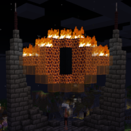
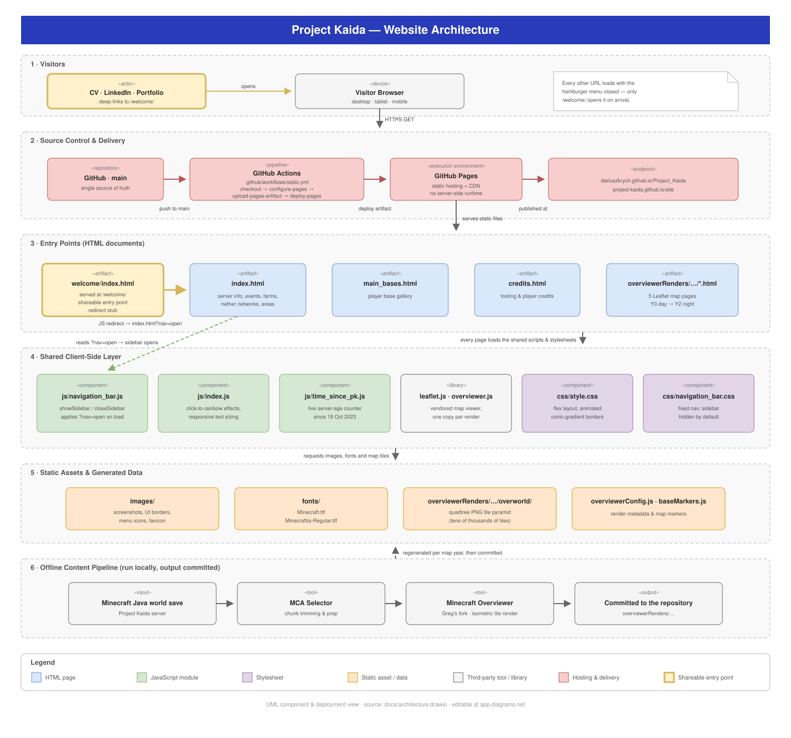

<div align="center">



# Project Kaida

**A hand-built, dependency-free static website that archives three years of a private Minecraft survival server —
its history, its builds, and 39,000+ rendered map tiles of the world itself.**

[](https://github.com/DariuszKrych/Project_Kaida/actions/workflows/static.yml)
[](#-tech-stack)
[](#-tech-stack)
[](#-tech-stack)
[](#-tech-stack)
[](#-engineering-notes)

**[🌍 Visit the site](https://project-kaida.github.io/site/welcome/)** · **[📐 Architecture](#-architecture)**


</div>

---

## 📖 Overview

Project Kaida is a private *forever-vanilla* Minecraft survival server, founded on **18 October 2023** by
AaroTron9000, ZakZNinja and X_Kazuma_X. This repository holds the community website that documents it.

The site is deliberately built from **plain HTML, CSS and JavaScript** — no framework, no bundler, no package
manager, no build step. Everything in this repository is exactly what the browser receives. That constraint keeps
the project fast, permanently reproducible, and free to host, while still supporting an interactive multi-year map
archive of roughly **2.4 GB across 39,575 rendered tiles**.

| | |
|---|---|
| **Live site** | <https://project-kaida.github.io/site/welcome/> · <https://dariuszkrych.github.io/Project_Kaida/welcome> |
| **Hosting** | GitHub Pages, deployed by GitHub Actions on every push to `main` |
| **Dependencies** | None installed — Leaflet is vendored alongside the generated map renders |
| **Server-side code** | None; the site is fully static |

---

## 📐 Architecture

A UML component & deployment view of the whole system — from a visitor's click through to the offline
map-rendering pipeline that produces the tile archive.

<p align="center">
  
</p>

> Source diagram: [`docs/architecture.drawio`](docs/architecture.drawio) — open and edit it in
> [draw.io / diagrams.net](https://app.diagrams.net/).

| Layer | Responsibility |
|---|---|
| **1 · Visitors** | Browsers on desktop, tablet and mobile. External links (CV, LinkedIn, portfolio) point at `/welcome/`. |
| **2 · Source control & delivery** | `main` is the single source of truth. `.github/workflows/static.yml` uploads the repository as a Pages artifact and deploys it. |
| **3 · Entry points** | Five content pages plus the `/welcome/` landing stub. Each one is a standalone HTML document. |
| **4 · Shared client-side layer** | Three small vanilla-JS modules and two stylesheets shared across every page; Leaflet and Overviewer are vendored per map render. |
| **5 · Static assets & data** | Screenshots, Minecraft-styled fonts, and the generated tile pyramid with its render metadata. |
| **6 · Offline content pipeline** | World save → MCA Selector → Minecraft Overviewer → tiles committed to the repository. Runs locally, never at request time. |

---

## ✨ Features

### 🏠 Home page
- **Server status & philosophy** — how and when the server runs.
- **Live foundation counter** — years, months and days since launch, computed in the browser on every visit.
- **Events timeline** — the *One Year Anniversary* and *Resurrection* events, with linked player-perspective videos.
- **Farm database** — seven public farms with output, type, coordinates and dimension.
- **Nether networks** — the ice-boat highway and the 2-wide road network that connect the world.
- **Areas** — Spawn, Halloween, Winter, Map Art and the Beta 1.7.3 island.

### 🏰 Main bases
A gallery of twelve original player builds, including **Brexit Giza** (AaroTron9000),
**Klein-Honningstal** (AlbertAllrad), **The Mines™** (AndroidJackBob), **HollowMoon** (ArchedRocketeer)
and **Barad-dûr** (ZakZNinja).

### 🗺️ Interactive world maps
Five full isometric Leaflet renders let you pan and zoom the real world save and watch it grow year over year:

| Render | Day | Night |
|---|:---:|:---:|
| Year 0 | ✅ | — |
| Year 1 | ✅ | ✅ |
| Year 2 | ✅ | ✅ |

### 🧭 Guided entry point — `/welcome/`
A dedicated shareable URL for CVs, profiles and posts. It loads the home page with the navigation menu
**already expanded**, so a first-time visitor immediately sees everything the site has to offer.
Every other URL keeps the normal behaviour and loads with the menu closed.

---

## 🛠️ Tech Stack

| Area | Choice | Why |
|---|---|---|
| Markup | **HTML5** | Static documents, no templating layer to maintain. |
| Styling | **CSS3** — flexbox, custom properties, `@property` conic-gradient animations, border-image | Animated Minecraft-style borders with zero images-in-JS and zero libraries. |
| Behaviour | **Vanilla JavaScript** (ES6) | Three focused modules, each under 150 lines. |
| Maps | **[Leaflet.js](https://leafletjs.com/)** | Tile-based pan/zoom viewer, vendored with each render. |
| Map generation | **[Minecraft Overviewer](https://github.com/overviewer/Minecraft-Overviewer)** + **[Greg's fork](https://github.com/GregoryAM-SP/The-Minecraft-Overviewer)** | Renders the world save into an isometric tile pyramid. |
| World prep | **[MCA Selector](https://github.com/Querz/mcaselector)** | Trims excess chunks before rendering. |
| CI/CD | **GitHub Actions** → **GitHub Pages** | Push to `main` publishes the site; nothing to run by hand. |
| Typography | **Minecraft** & **Minecraftia** webfonts | Self-hosted, so the site has no third-party runtime requests. |

---

## 📂 Project Structure

```
Project_Kaida/
├── index.html                  # Home — server info, events, farms, networks, areas
├── main_bases.html             # Gallery of player bases
├── credits.html                # Tooling and player credits
├── welcome/
│   └── index.html              # Shareable entry point; opens the site with the menu expanded
├── css/
│   ├── style.css               # Layout, theming, animated gradient borders
│   └── navigation_bar.css      # Fixed navigation; sidebar hidden by default
├── js/
│   ├── index.js                # Interactive highlight effects, responsive text sizing
│   ├── navigation_bar.js       # Sidebar open/close + ?nav=open initial state
│   └── time_since_pk.js        # Live "time since foundation" counter
├── images/                     # Screenshots, UI borders, icons, favicon
├── fonts/                      # Minecraft.ttf, Minecraftia-Regular.ttf
├── overviewerRenders/          # 5 Leaflet map renders + generated tile pyramids
│   └── KaidaY<n> <time>/
│       ├── y<n><time>.html     # Map page
│       ├── overviewerConfig.js # Render metadata
│       └── overworld/          # Quadtree PNG tiles
├── docs/
│   ├── architecture.drawio     # Editable architecture diagram
│   └── architecture.svg        # Rendered version used in this README
└── .github/workflows/
    └── static.yml              # Deploy to GitHub Pages
```

---

## 🔧 Engineering Notes

A few decisions in here that were deliberate rather than accidental:

- **No build step, on purpose.** What is committed is what is served. The site will still build and deploy
  identically in ten years, with no dependency tree to rot.
- **Automated deploys.** A push to `main` triggers `static.yml`, which publishes the whole repository to
  GitHub Pages. There is no manual release process.
- **Shared navigation, duplicated nowhere.** All six page types load the same `navigation_bar.js` and
  `navigation_bar.css`; the sidebar's default hidden state lives in CSS, and JavaScript only reacts to input.
- **`/welcome/` is a stub, not a copy.** Rather than duplicating the home page to change one default, the
  landing URL is a small redirect that forwards to `index.html?nav=open`; `navigation_bar.js` reads that flag
  once on load. One page of truth, one shareable URL, and a `<noscript>` fallback for JavaScript-off browsers.
- **Race-safe initialisation.** Scripts are loaded `async defer`, so they may execute before *or* after the DOM
  is parsed. The initialiser checks `document.readyState` instead of blindly waiting for `DOMContentLoaded`,
  which would silently never fire in the late case.
- **Responsive by measurement.** Layout adapts through flexbox and `min()` widths, with a JavaScript width
  observer stepping typography down on narrow viewports.
- **Heavy assets stay offline.** Rendering 39,575 map tiles is expensive, so it happens locally and only the
  finished output is committed — the request path stays a plain static file read.

---

## 🚀 Running It Locally

The site is fully static, so no toolchain is required.

```bash
git clone https://github.com/DariuszKrych/Project_Kaida.git
cd Project_Kaida
```

Then either open `index.html` directly in a browser, or — recommended, so that paths and the `/welcome/`
route behave exactly as they do in production — serve the folder:

```bash
python -m http.server 8000
```

| URL | What you get |
|---|---|
| <http://localhost:8000/> | Home page, navigation menu closed |
| <http://localhost:8000/welcome/> | Home page, navigation menu expanded |
| <http://localhost:8000/main_bases.html> | Base gallery |

> **Note:** the repository includes the full map renders (~2.4 GB), so the initial clone takes a while.

---

## 🧪 The Content Pipeline

The interactive maps are not generated at request time. Each yearly render is produced offline and committed:

1. **Capture** the Minecraft Java world save from the server.
2. **Prepare** it in *MCA Selector* — trim excess chunks and remove the chunks that spell out the
   "Project Kaida 20XX/20XX" map text.
3. **Render** with *Minecraft Overviewer* (Greg's fork for current world versions) into an isometric,
   zoomable quadtree of PNG tiles.
4. **Commit** the render, its `overviewerConfig.js` metadata and its Leaflet page into `overviewerRenders/`.

---

## 👥 Credits & Thanks

- **[Minecraft Overviewer](https://github.com/overviewer/Minecraft-Overviewer)** — isometric map rendering.
- **[Greg's fork of Minecraft Overviewer](https://github.com/GregoryAM-SP/The-Minecraft-Overviewer)** — keeps
  rendering working with the latest world versions.
- **[MCA Selector](https://github.com/Querz/mcaselector)** — chunk editing and pre-render preparation.
- **[Leaflet](https://leafletjs.com/)** — the map viewer behind every render.
- **Every Project Kaida player** — for building the world this site exists to document. ^^

---

<div align="center">

**Website built and maintained by [X_Kazuma_X](https://github.com/DariuszKrych).**

Screenshots and builds remain the work of their respective creators.

</div>
